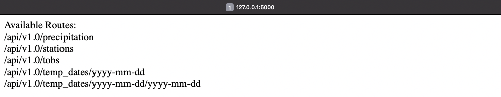

# SQLAlchemy Challenge

Analyse weather data from various weather stations in Hawaii using Python, SQLAlchemy and SQLite!

Created and submitted for an assignment for Monash University Data Analytics Boot Camp (August 2023).

## Table of Contents

- [General info](#general-info)
- [Technologies](#technologies)
- [Screenshot](#screenshot)
- [Code example](#code-example)
- [References](#references)

## General info

### hawaii_query_code.ipynb

- Queries weather data from SQLite database using SQLAlchemy.  
- Plots query results on graphs using Matplotlib.

### hawaii_api_app.py

- Integrates queries from hawaii_query_code.ipnyb into web server app that is accessible using api queries.

## Technologies

Project created and run using:

- Python 3.10.9
  - Pandas 1.5.3
  - NumPy 1.24.3
  - Matplotlib 3.7.1
- SQLAlchemy 1.4.39
- SQLite 3.41.2
- Visual Studio Code 1.79.2
- Jupyter Notebook 5.3.0

## Screenshot

#### API Web Server



## Code example

```python
# Code Snippet from hawaii_api_app.py
#################################################    

@app.route("/api/v1.0/tobs")
def tobs():
    # Create session (link) from Python to the DB
    session = Session(engine)

    """Return tobs data"""
    # Query rainfall for last 12 months from most active station
    temp_query = session.query(Measurements.date, Measurements.tobs).\
                 filter(Measurements.station == 'USC00519281').\
                 filter(Measurements.date >= '2016-08-18').\
                 filter(Measurements.date <= '2017-08-18').\
                 order_by(Measurements.date.desc()).all()

    session.close()

    # Transform query result into List of Dictionaries for JSONification
    temperature_list = []
    for date, temp in temp_query:
        temp_dictionary = {}
        temp_dictionary[date] = temp
        temperature_list.append(temp_dictionary)
    return jsonify(temperature_list)

#################################################

@app.route("/api/v1.0/temp_dates/<start>")
def temp_dates_start(start):
    # Create session (link) from Python to the DB
    session = Session(engine)

    """Return tobs data"""
    # Query TMIN, TMAX and TAVG for defined time period
    temp_stats_functions = [func.min(Measurements.tobs),
                            func.max(Measurements.tobs),
                            func.avg(Measurements.tobs)]

    temp_start_stats = session.query(*temp_stats_functions).\
                       filter(Measurements.date >= start).\
                       order_by(Measurements.station).all()

    session.close()

    # Transform query result into List for JSONification
    stats_start_dictionary = {
    'TMIN' : temp_start_stats[0][0],
    'TMAX' : temp_start_stats[0][1],
    'TAVG' : temp_start_stats[0][2]}
    return jsonify(stats_start_dictionary)

#################################################
```

## References

- Code, in general, was adapted from Monash University Data Analytics Boot Camp 2023 course learning material.


Created and written by Samuel Palframan - August 2023.
